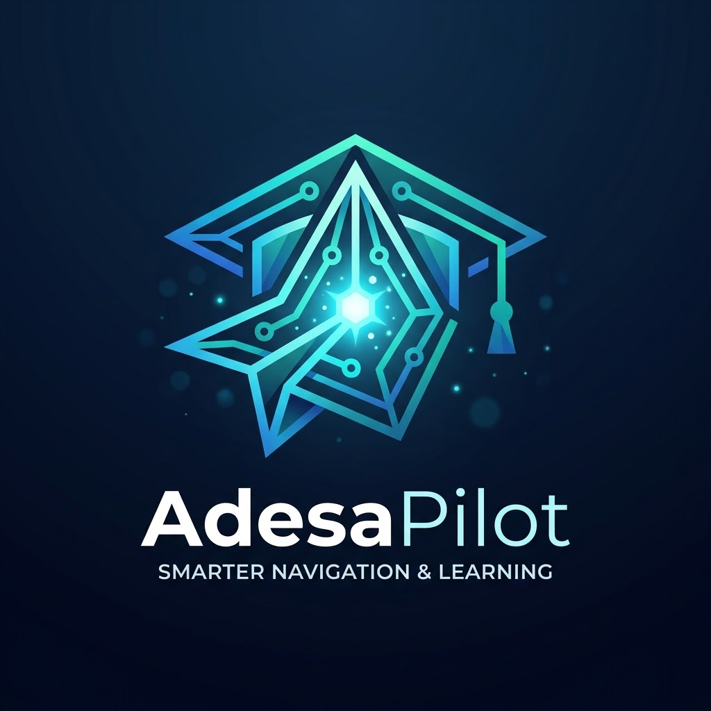

<div align="center">

<!-- Coloca tu logo aquí: guarda la imagen como "logo.png" en la carpeta raíz del proyecto -->


# AdesaPilot

### Asistente Académico Autónomo para la UNCP

[](https://www.python.org/)
[](https://fastapi.tiangolo.com/)
[](https://playwright.dev/)
[](https://ai.google.dev/)
[](LICENSE)

*Un agente de IA que gestiona tu vida académica universitaria: sincroniza tareas, organiza tus archivos y automatiza entregas en la plataforma virtual.*

</div>

---

## 📖 ¿Qué es AdesaPilot?

**AdesaPilot** es un asistente académico personal e inteligente diseñado para estudiantes de la Universidad Nacional del Centro del Perú (UNCP). Actúa como un "copiloto" que elimina la fricción administrativa al monitorear proactivamente todas las tareas de la plataforma virtual, organizar automáticamente los materiales y entregables en un sistema de archivos estandarizado, y automatizar la subida de trabajos mediante una interfaz visual intuitiva o lenguaje natural — siempre bajo un flujo seguro que requiere la confirmación final del usuario.

---

## ✨ Características Principales

| Funcionalidad | Descripción |
|---|---|
| 🔄 **Sincronización Automática** | Extrae cursos y tareas pendientes en tiempo real desde el ERP de la UNCP |
| 🔔 **Alertas Proactivas** | Notifica automáticamente al iniciar si hay tareas con vencimiento en ≤ 3 días |
| 📁 **Gestión de Archivos Local** | Crea y mantiene la estructura `UNCP/[Curso]/Materiales/Tareas/` automáticamente |
| 💬 **Chat en Lenguaje Natural** | Interfaz conversacional para emitir instrucciones al agente |
| 🖱️ **Drag & Drop de Entregas** | Arrastra uno o varios archivos sobre una tarea para iniciar el proceso de entrega |
| ⛔ **Bloqueo de Tareas Vencidas** | Impide todo intento de entrega sobre tareas con fecha de cierre expirada |
| 🤖 **Agente ReAct** | Motor de razonamiento que planifica y ejecuta pasos automáticamente hasta completar tu solicitud |
| 🔐 **Confirmación Obligatoria** | El agente NUNCA envía una tarea sin aprobación explícita del usuario |

---

## 🏗️ Arquitectura del Proyecto

```
UNCP_agent/
├── 📄 .env                    # Variables de entorno (credenciales) — NO subir a git
├── 📄 .env.example            # Plantilla de variables de entorno
├── 📄 AGENTS.md               # Principios operativos y restricciones del agente
├── 📄 Especificaciones.md     # Criterios de aceptación del producto
│
├── 📁 backend/                # API + Motor del Agente
│   ├── main.py                # Servidor FastAPI (endpoints REST)
│   ├── requirements.txt       # Dependencias Python
│   └── src/
│       ├── agent.py           # Loop ReAct: razonamiento y ejecución de herramientas
│       ├── tools.py           # Herramientas del agente (sincronizar, enviar, listar...)
│       ├── core/
│       │   └── db.py          # Inicialización y conexión SQLite
│       └── services/
│           ├── scraper.py     # Automatización Playwright (login, scraping, subida)
│           └── file_manager.py# Gestión del sistema de archivos local UNCP/
│
├── 📁 frontend/               # Interfaz Web (SPA)
│   ├── index.html             # Estructura HTML principal
│   ├── style.css              # Sistema de diseño y estilos
│   └── app.js                 # Lógica de UI, chat, drag & drop, alertas
│
└── 📁 UNCP/                   # Carpeta raíz de archivos académicos (auto-creada)
    └── [Nombre_del_Curso]/
        ├── Materiales/        # Sílabos, diapositivas, lecturas
        └── Tareas/            # Archivos entregables listos para subir
```

**Stack tecnológico:**
- **Backend:** Python 3.10+, FastAPI, Uvicorn, SQLite
- **Automatización:** Playwright (Chromium)
- **Motor LLM:** Google Gemini (compatible con SDK OpenAI)
- **Frontend:** HTML5, CSS3 (Vanilla), JavaScript (ES6+)

---

## 📋 Requisitos Previos

Antes de ejecutar el proyecto, asegúrate de tener instalado:

- **Python 3.10 o superior** → [Descargar Python](https://www.python.org/downloads/)
- **pip** (incluido con Python)
- Una cuenta activa en el portal ERP de la UNCP
- Una **API Key de Google Gemini** → [Obtener API Key](https://aistudio.google.com/app/apikey)

---

## ⚙️ Instalación

### Paso 1: Clonar el repositorio

```bash
git clone https://github.com/tu-usuario/UNCP_agent.git
cd UNCP_agent
```

### Paso 2: Instalar dependencias de Python

```bash
cd backend
pip install -r requirements.txt
```

### Paso 3: Instalar el navegador de Playwright

```bash
python -m playwright install chromium
```

### Paso 4: Configurar las variables de entorno

Copia el archivo de ejemplo y rellena tus datos:

```bash
# Desde la carpeta raíz del proyecto
cp .env.example .env
```

Edita el archivo `.env` con tus credenciales:

```env
# ─── Credenciales del Portal ERP UNCP ────────────────────────────────────────
UNCP_USER=tu_codigo_de_estudiante
UNCP_PASS=tu_contraseña_del_portal

# ─── Configuración del Modelo de Lenguaje (LLM) ──────────────────────────────
LLM_PROVIDER=gemini
OPENAI_API_KEY=tu_gemini_api_key_aqui
GEMINI_MODEL=gemini-2.0-flash
```

> ⚠️ **Importante:** Nunca subas el archivo `.env` a un repositorio público. Ya está incluido en el `.gitignore`.

---

## 🚀 Cómo Ejecutar

Necesitas **dos terminales** abiertas simultáneamente.

### Terminal 1 — Iniciar el Backend (API + Agente)

```bash
cd backend
python -m uvicorn main:app --host 127.0.0.1 --port 8000 --reload
```

Verifica que veas el siguiente mensaje de confirmación:
```
==================================================
  AdesaPilot API — Servidor iniciado
  Proveedor LLM: GEMINI
==================================================
INFO:     Uvicorn running on http://127.0.0.1:8000
```

### Terminal 2 — Iniciar el Frontend (Interfaz Web)

```bash
cd frontend
python -m http.server 5500
```

### Acceder a la Aplicación

Abre tu navegador y dirígete a:

```
http://localhost:5500
```

---

## 🎮 Primeros Pasos con AdesaPilot

Una vez que la interfaz esté cargada, sigue este flujo inicial:

1. **Sincronizar el Portal** → Haz clic en el botón `Sincronizar Portal` en la barra lateral izquierda. El agente abrirá el navegador, iniciará sesión y extraerá todos tus cursos y tareas automáticamente.

2. **Revisar tus tareas** → Los cursos aparecerán como acordeones desplegables en el panel izquierdo. Cada tarea muestra su estado, fecha límite y permite el drag & drop para entregas.

3. **Organizar carpetas locales** → Escribe en el chat: `"Organiza mis carpetas de cursos"`. El agente creará la estructura `UNCP/[Curso]/Materiales/Tareas/` para todos tus cursos.

4. **Entregar una tarea** → Coloca tu archivo en `UNCP/[Nombre_del_Curso]/Tareas/`, selecciónalo en el panel derecho y arrástralo sobre la tarjeta de la tarea correspondiente.

### Comandos de Ejemplo

```
"¿Cuáles son mis tareas pendientes?"
"Sincroniza mis cursos con la plataforma"
"¿Qué archivos tengo listos en el curso de Redes?"
"Sube mi informe al curso de Diseño de Base de Datos"
```

---

## 🔐 Seguridad y Límites del Agente

El agente opera bajo restricciones estrictas definidas en [`AGENTS.md`](AGENTS.md):

| Restricción | Detalle |
|---|---|
| ✅ **Sin envíos automáticos** | El agente pausa el navegador antes del clic final para que el usuario confirme |
| ✅ **Origen controlado de archivos** | Solo puede enviar archivos ubicados en `UNCP/[Curso]/Tareas/` |
| ✅ **Sin interacción en foros** | Prohibido publicar comentarios o interactuar en espacios colaborativos |
| ✅ **Sin modificación de perfil** | No puede alterar datos personales del portal universitario |
| ✅ **Tareas vencidas bloqueadas** | Imposible iniciar un envío sobre una tarea con fecha de cierre expirada |
| ✅ **Datos 100% locales** | Historial y tareas almacenados en SQLite local. Las credenciales nunca se registran |


<div align="center">

Desarrollado con ❤️ para estudiantes de la UNCP

</div>
